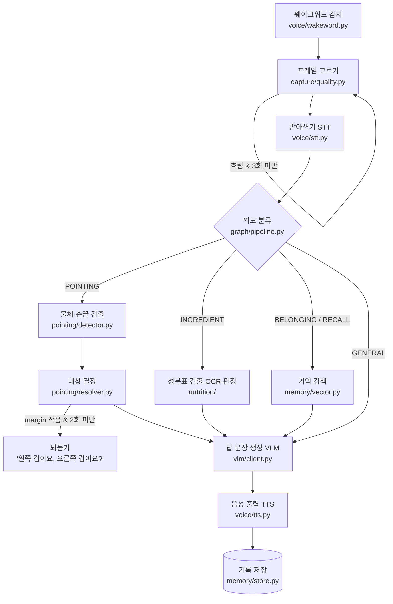

# 뼈대 설명 — 지금 코드가 어떻게 생겼나

> 개발을 시작하기 전에 세 사람이 같은 그림을 갖기 위한 문서다.
> 2026-09-30 기준 `src/jarviseo/` 코드를 그대로 따라가며 설명한다.

---

## 0. 30초 요약

1. **질문 한 번 = 한 방향으로 흐르는 파이프라인**이다.
   "자비서" 호출 → 그 순간의 사진 1장 고르기 → 말 받아쓰기 → 무슨 질문인지 분류 → 특화 모듈 처리 → VLM이 답 문장 만들기 → 소리로 읽기.
2. 이 흐름을 **LangGraph**가 묶는다. 중간에 **되돌아가는 길이 두 개** 있다. 사진이 흐리면 다시 찍고(recapture), 가리킨 게 애매하면 되묻는다(clarify).
3. 세 사람은 서로 다른 폴더를 만든다. 대신 **주고받는 데이터의 모양은 `types.py` 한 파일에 미리 정해 뒀다.** 각자 이 모양만 지키면 나중에 합칠 때 안 깨진다.
4. 지금 **실제로 돌아가는 코드는 카메라 입력(`capture/`)과 DB 저장(`memory/models.py`, `store.py`)뿐**이다. 나머지는 함수 이름과 설명만 있고, 속은 `raise NotImplementedError`(아직 안 만듦 표시)다.
   즉 이건 "완성된 코드"가 아니라 **"누가 어디에 무엇을 채울지 정해 둔 빈 칸"**이다.

---

## 1. 질문 한 번이 지나가는 길

사용자가 컵 두 개가 놓인 책상 앞에서 오른쪽 컵을 가리키며 **"자비서, 저거 뭐야?"** 하고 묻는 장면으로 따라가 본다.



### ① 호출어 감지 — `voice/wakeword.py` (문태현)

마이크를 계속 듣다가 "자비서"가 들리면 깨어난다.
이 단계는 **반드시 노트북 안(로컬)에서만** 돈다. 항상 켜져 있는 부분을 클라우드로 보내면 "안경이 계속 녹음해서 어딘가로 보내는 것 아니냐"는 질문에 답할 수 없기 때문이다.

### ② 사진 1장 고르기 — `capture/` (공용, **이미 구현됨**)

카메라는 초당 30장을 찍는다. 그중 **어느 한 장**을 골라야 한다. 여기서 알려진 함정이 두 개 있다.

- **말이 끝난 뒤에 찍으면 늦다.** "저거 뭐야?"를 다 말했을 때는 이미 고개가 돌아가 있다. 그래서 **말을 시작한 시각** 근처의 사진을 고른다.
- **고개를 움직이면 사진이 흐리다.** 그래서 한 장만 찍지 않고, 최근 30장(약 1초 분량)을 버퍼에 들고 있다가 그중 가장 선명한 것을 고른다.

`FrameBuffer.pick_best(around=말_시작_시각, window=0.5)`가 바로 이 일을 한다. 말 시작 전후 0.5초 안의 사진만 추린 뒤, 그중 가장 선명한 것을 돌려준다.

선명도는 `laplacian_variance()`로 잰다. 초점이 맞은 사진은 물체 경계에서 밝기가 확 바뀌고, 흐린 사진은 그 경계가 뭉개진다. 이 "밝기가 얼마나 급하게 바뀌나"를 숫자 하나로 바꾼 것이다. 클수록 선명하다.

골라 온 사진도 너무 흐리면(`is_too_blurry`) **다시 찍는다**. 단, 흐린 장면 앞에서 영원히 다시 찍지 않도록 최대 2번까지만 한다(`MAX_RECAPTURE = 2`).

### ③ 받아쓰기 — `voice/stt.py` (문태현)

음성을 글자로 바꾼다. 결과는 `Utterance`에 담긴다.
여기서 가장 중요한 값은 글자가 아니라 **`started_at`(말을 시작한 시각)**이다. ②의 사진 고르기가 이 값을 기준으로 움직인다. VAD(음성 구간 검출, 소리 중에서 사람이 말하는 구간만 잘라내는 기능)가 이 시각을 알려준다.

### ④ 의도 분류 — `graph/pipeline.py` (최홍묵)

"무슨 종류의 질문인가"를 5가지 중 하나로 정한다. `types.py`의 `Intent`다.

| Intent | 예시 발화 | 다음에 갈 곳 |
|---|---|---|
| `POINTING` | "저거 뭐야?" | ① 지시 대상 특정 |
| `INGREDIENT` | "이거 뭐 들어갔어?" | ② 식품 성분 판정 |
| `BELONGING` | "내 가방 어디 있어?" | ③ 소지품 재인식 |
| `RECALL` | "아까 본 그거 뭐였지?" | ④ 개인 기억 검색 |
| `GENERAL` | 그 외 전부 | 특화 없이 바로 VLM |

`GENERAL`이 **안전망**이다. 특화 모듈이 "내 일 아님"이라고 판단하면 여기로 떨어지고, 범용 VLM이 그냥 답한다. 그래서 질문 주제에 제한이 없다.

### ⑤-A 지시 대상 특정 — `pointing/` (최홍묵)

화면에 컵이 두 개 있을 때 "저거"가 어느 컵인지 정하는 부분이다. **이 프로젝트의 핵심 기여**이고, 세 파일로 나뉜다.

1. **`detector.py` — 무엇이 어디 있나 찾기 (딥러닝)**
   - `ObjectDetector`: 사전학습된 YOLO(이미지에서 물체 위치를 박스로 찾아주는 모델)를 그대로 써서 컵·병·가방 같은 후보를 찾는다.
   - `FingertipDetector`: 손가락 끝을 찾는다. 사전학습 YOLO는 "사람"은 알아도 "검지 끝"은 모르기 때문에, **여기만 직접 데이터를 모아 파인튜닝한다.**
2. **`cues.py` — 단서별로 점수 매기기 (딥러닝 아님, 좌표 계산)**
   후보 물체마다 "이게 가리킨 것일 가능성"을 단서 5개로 각각 0~1점씩 준다. 이름은 ERD `cue_scores`의 키와 같다.
   - `CENTER`: 화면 가운데에 크게 찍혔을수록 높다. 다른 단서가 하나도 없을 때의 기본값이다.
   - `POINT`: 손끝이 뻗은 방향에 있을수록 높다.
   - `GAZE`: 시선 방향에 있을수록 높다.
   - `LANG`: "빨간 거", "왼쪽 거" 같은 말과 맞을수록 높다.
   - `CTX`: 직전 질문에서 확정한 대상과 이어질수록 높다. "그거 얼마야?"처럼 같은 대상을 다시 묻는 경우다.
3. **`resolver.py` — 점수 합쳐서 결정하기**
   단서 점수에 가중치(`WEIGHTS`: 손끝 0.40, 언어 0.25, 시선 0.15, 중앙 0.10, 맥락 0.10)를 곱해 더하고, 1등을 고른다.
   이때 **1등과 2등의 점수 차이(margin)**가 0.15보다 작으면 단정하지 않고 되묻는다. 예를 들어 오른쪽 컵 0.62점, 왼쪽 컵 0.55점이면 차이가 0.07이라 "왼쪽 컵이요, 오른쪽 컵이요?"라고 묻는다.

**왜 되묻나:** 안경에는 화면이 없다. 틀린 답을 자신 있게 말하면 사용자는 틀린 줄도 모른다. 그래서 착용형 비서에서는 **틀린 단정이 침묵보다 나쁘다**. 되묻기도 무한히 하지 않는다. 2번까지만 묻고, 그 뒤에는 1등으로 답한다(`MAX_CLARIFY = 2`).

**ablation과의 관계:** `resolve_target()`의 `enabled_cues` 인자가 단서를 켜고 끄는 스위치다. ablation(단서를 하나씩 켜 가며 정확도가 얼마나 오르는지 재는 실험)을 이 스위치로 한다.
`{CENTER}` 하나만 켜면 baseline(v1, 아무 단서도 안 쓴 출발점)이 되고, 여기에 POINT, GAZE, LANG, CTX를 차례로 켜며 v2~v5 표를 채운다. 이 표가 발표의 중심이다.

### ⑤-B 식품 성분 판정 — `nutrition/` (권용현)

과자를 들고 "이거 뭐 들어갔어?" 하면 세 단계를 거친다.

1. `detector.py` — 포장에서 **성분표 영역만** 찾는다(YOLO 파인튜닝). 봉지 전체를 OCR에 넣으면 제품명·광고 문구가 다 섞여 나오기 때문이다.
2. `ocr.py` — 그 영역을 잘라 **3배로 키운 뒤** 글자를 읽는다. 성분표 글자는 약 2mm라 그대로는 너무 작다.
3. `allergen.py` — 읽은 성분을 사용자 알레르기와 대조한다. 결과는 `SAFE`(안전) / `WARN`(경고) / `UNCERTAIN`(판단 불가) 셋 중 하나다.

여기서 지키는 원칙은 **애매하면 SAFE라고 하지 않는 것**이다. 땅콩을 놓치는 피해가 경고를 한 번 더 하는 피해보다 훨씬 크기 때문이다.
그리고 판정의 정확도를 정하는 것은 모델이 아니라 **동의어 사전**이다. 성분표에는 "우유"가 아니라 "탈지분유", "카제인", "유청"이라고 적혀 있다. 사전에 이 짝이 없으면 아무것도 못 잡는다.

### ⑤-C 소지품 · 기억 — `memory/vector.py` (문태현)

"아까 본 그거"처럼 정확한 이름을 모르는 질문에 답하려고, 과거 기록을 **뜻이 비슷한 것끼리** 찾는다. pgvector(Postgres에 붙이는 벡터 검색 확장. 문장이나 이미지를 숫자 목록으로 바꿔 저장해 두고 비슷한 것을 찾아준다)를 쓴다.
두 테이블을 검색한다. `belonging_image`에는 등록한 내 물건 사진을, `observation`에는 과거에 본 장면 설명을 넣는다.

### ⑥ 답 문장 만들기 — `vlm/client.py` (공용)

VLM(이미지와 글을 같이 이해하는 언어 모델)에게 **사진 1장 + 질문 + 특화 모듈 결과**를 보내고 답 문장을 받는다.

- ⑤-A 결과가 있으면 "사용자가 가리킨 것은 화면 오른쪽의 컵입니다"라고 범위를 좁혀서 보낸다. **팀에서 확정한 결정대로, 전체 프레임이 아니라 가리킴 모델이 확정한 부분(크롭)을 넘긴다.** 전체 사진을 던지면 VLM이 알아서 고르게 되고, 그러면 ⑤-A를 만든 의미가 사라진다.
- ⑤-B 결과가 있으면 판정 결과를 **사실로 주고, VLM에게 다시 판정하라고 시키지 않는다.** 판정은 규칙이 내리고, VLM은 문장만 다듬는다. 모델이 지어낸 알레르기 판단이 나가면 안 되기 때문이다.

이 파일이 **네트워크로 데이터가 나가는 유일한 곳**이다. 그리고 나가는 것은 질문한 순간의 사진 1장뿐이다.

### ⑦ 음성 출력 — `voice/tts.py` (문태현)

답을 소리로 읽는다. 여기에는 함정이 하나 있다. 스피커 소리를 마이크가 다시 듣고 "자비서"로 착각해 자기 말에 또 반응하면 끝없이 되풀이된다.
그래서 **재생하는 동안, 그리고 끝난 뒤 0.3초 더 마이크를 막는다**(`TTS_MIC_GATE_SEC`).

### ⑧ 기록 — `memory/store.py` (**이미 구현됨**)

질문 1번의 전 과정을 DB에 남긴다. 대시보드의 대화 이력, 단계별 지연 그래프, 정확도 측정이 전부 이 기록에서 나온다. 자세한 내용은 5장에 있다.

---

## 2. 폴더 지도

```
src/jarviseo/
├── types.py          ★ 세 사람의 계약. 주고받는 데이터 모양 전부
├── config.py         ★ 환경변수·경로를 읽는 유일한 곳
├── graph/            LangGraph로 전체 흐름 엮기           최홍묵
│   ├── state.py        노드 사이에 넘기는 상태
│   └── pipeline.py     노드·분기 구성
├── capture/          카메라 입력·선명도                  공용   ✅ 구현됨
├── pointing/         ① 지시 대상 특정                    최홍묵
├── nutrition/        ② 식품 성분 판정                    권용현
├── memory/           DB + ③④ 소지품·기억
│   ├── models.py       테이블 13개 정의                  ✅ 구현됨
│   ├── store.py        DB 읽고 쓰기                      ✅ 구현됨
│   └── vector.py       pgvector 벡터 검색                문태현
├── voice/            웨이크워드·STT·TTS                  문태현
├── vlm/              범용 VLM 호출                       공용
└── api/              FastAPI 서버·대시보드               권용현  (/health만)

scripts/spike/        1주차 "되는지만 확인" 스크립트 5개
tools/device_check/   카메라·마이크 점검 도구 5개         ✅ 구현됨
tests/                자동 테스트 (계약 6개 + DB 7개)
```

### 지금 돌아가는 것 / 아직 빈 칸인 것

| 상태 | 무엇 |
|---|---|
| ✅ 돌아감 | `types.py`, `config.py`, `capture/` 전체, `memory/models.py`, `memory/store.py`, `api/main.py`의 `/health`, `tools/device_check/`, `scripts/spike/spike_01_capture.py` |
| ⬜ 이름·설명만 있음 | `graph/pipeline.py`, `pointing/` 전체, `nutrition/` 전체, `voice/` 전체, `vlm/client.py`, `memory/vector.py`, 스파이크 2~5 |

⬜ 파일을 열면 함수 이름, 인자, 반환 타입, 그리고 **"어떻게 만들어야 하는지"를 적은 설명(docstring)**까지 들어 있다. 몸통만 비어 있다. 각자 할 일은 **이 설명을 읽고 몸통을 채우는 것**이다.

---

## 3. 꼭 알아야 할 파일 세 개

### `types.py` — 모듈 사이의 계약

세 사람이 각자 모듈을 만들면, 합치는 순간 "나는 좌표를 `(x, y, w, h)`로 줬는데 너는 `(x1, y1, x2, y2)`로 받았네" 같은 일이 터진다. 이 파일은 그걸 미리 막는다. **모든 모듈은 여기 정의된 모양으로만 데이터를 주고받는다.**

`@dataclass`(필드만 선언하면 생성자를 자동으로 만들어 주는 파이썬 문법)로 만든 클래스 15개가 들어 있다. 자바로 치면 DTO 모음이다.

| 무리 | 클래스 | 한 줄 설명 |
|---|---|---|
| 기본 | `BBox` | 사각형 좌표 `(x1, y1, x2, y2)`. 넓이·중심·겹침(IoU) 계산이 들어 있다 |
| | `Frame` | 사진 1장 + **찍은 시각** + 선명도 |
| | `Detection` | 검출된 물체 1개 (이름, 확신도, 박스) |
| 음성 | `Utterance` | 받아쓴 발화 + **말 시작 시각** |
| | `Intent` | 질문 종류 5가지 |
| ① | `CueKind` | 단서 종류 5가지 (CENTER/POINT/GAZE/LANG/CTX) |
| | `CueScore` | 단서 하나가 준 점수 |
| | `TargetCandidate` | 후보 물체 + 단서별 점수 + 합계 |
| | `TargetResolution` | 최종 결과: 후보 순위, 고른 것, margin, 되물을지 |
| ② | `OCRLine`, `IngredientPanel` | 읽은 글자 한 줄 / 성분표 전체 |
| | `AllergenVerdict`, `AllergenJudgement` | SAFE/WARN/UNCERTAIN 판정과 근거 |
| ③④ | `MemoryHit` | 검색해 온 과거 기록 1개 |
| 출력 | `AssistantResponse` | 최종 답 + 단계별 걸린 시간 |

공통 약속 네 가지도 여기서 정한다.

- 좌표는 **픽셀 단위**이고, 원점은 사진의 왼쪽 위다.
- 시각은 **`time.monotonic()`**(컴퓨터가 켜진 뒤 흐른 초. 시스템 시계를 바꿔도 거꾸로 가지 않음)을 쓴다. 사진 시각과 말 시작 시각을 빼서 비교해야 하기 때문이다.
- 점수는 전부 **0.0~1.0**이다.
- 경로는 전부 **`pathlib.Path`**다. 문자열로 `"/"`를 이어 붙이면 윈도우에서 깨진다.

**바꿀 때 규칙:** 필드 하나만 바뀌어도 남의 코드가 조용히 깨진다. 그래서 혼자 고치지 않는다. 팀 채널에 먼저 공지하고, 커밋 타입 뒤에 `!`를 붙인다(`feat(types)!: ...`).
`tests/test_types_contract.py`가 필드 이름을 검사하고 있어서, 모르고 바꾸면 테스트가 먼저 빨간불을 켠다.

### `graph/state.py` — 노드 사이의 계약

LangGraph는 **노드**(일 하나를 하는 함수)들을 **엣지**(다음에 어디로 갈지)로 잇는 방식이다. 노드끼리는 `JarviseoState`라는 딕셔너리 하나를 계속 넘겨받으며 채워 간다.

비유하면 **서류철 하나가 부서를 돈다.** STT 부서는 `utterance` 칸을 채우고, 검출 부서는 `detections` 칸을, 결정 부서는 `target` 칸을 채운다. 각 노드는 자기가 채운 칸만 돌려주면 된다(`total=False`라서 빈 칸이 있어도 된다).

`types.py`가 "모듈이 주고받는 모양"이라면, 이 파일은 "그래프 안에서 흘러다니는 모양"이다. 바꿀 때 규칙도 같다.

되풀이 횟수를 세는 칸(`recapture_count`, `clarify_count`)도 여기 있다. 이 숫자가 있어야 "3번 다시 찍었으면 그만"을 판단할 수 있다.

### `config.py` — 설정을 읽는 유일한 곳

각 모듈이 `os.getenv()`를 제각각 부르면, 윈도우에서만 안 될 때 어디를 봐야 할지 모른다. 그래서 **환경변수와 경로는 전부 여기서만 읽는다.** 다른 파일은 `from jarviseo import config` 후 `config.DATABASE_URL`처럼 가져다 쓴다.

알아 둘 값들:

- `FRAME_SOURCE` — 입력원을 고른다: `webcam` / `usbcam` / `video` / `folder`. 카메라가 없을 때는 `video`나 `folder`로 두면 된다.
- `CLARIFY_MARGIN_THRESHOLD` (0.15) — 되묻기 기준. ablation으로 정할 값이라 지금은 출발점일 뿐이다.
- `ENABLE_*` — **기능 플래그**. 덜 만든 기능도 꺼 둔 채로 main에 합친다. 브랜치를 오래 들고 있으면 충돌이 커지기 때문이다. 기능이 다 되면 플래그와 `if` 분기를 **같이 지운다.**
- `DATABASE_URL` — 기본은 Postgres다. `sqlite:///data/jarviseo.db`로 바꾸면 도커 없이도 돈다. 발표장에서 노트북 메모리가 빠듯할 때를 대비한 탈출구다.

설정값은 `.env` 파일에 둔다. `.env.example`을 복사해서 만들고, **`.env`는 커밋하지 않는다**(API 키가 들어 있다).

---

## 4. `capture/` — 이미 돌아가는 부분

### 입력원 네 종류, 쓰는 법은 하나

```python
with WebcamSource(0) as src:          # 노트북 내장 카메라
with USBCamSource(0) as src:          # 안경 카메라 (1080p)
with VideoFileSource("a.mp4") as src: # 녹화 영상
with ImageFolderSource("imgs/") as src: # 사진 폴더 (평가셋용)
    frame = src.read()
```

네 개 모두 `FrameSource`라는 같은 부모(자바의 추상 클래스와 같다)를 물려받아서, 어떤 입력원이든 `read()`와 `stream()`으로 똑같이 쓴다.

**왜 이렇게 했나:** 안경 카메라는 **팀에 1대뿐이고 예비도 없다.** 카메라가 한 사람 손에 있는 동안 다른 두 사람의 개발이 멈추면 안 된다. 그래서 카메라가 없는 사람은 `VideoFileSource`로 공용 Drive에 올린 녹화 영상을 쓴다. **코드는 한 줄도 안 바꾸고 입력원만 바꾼다.**
덤으로 **재현성**도 생긴다. 같은 영상을 넣으면 매번 같은 결과가 나와서, 버그를 다시 일으켜 보거나 실험을 비교하기 쉽다.

### 윈도우 대비가 이미 들어 있다

- 윈도우에서는 카메라를 `CAP_DSHOW` 방식으로 열어야 느려지지 않는다. `_open_capture()`가 OS를 보고 알아서 고른다. **OS별 분기는 이 함수 안에서만 한다.**
- `cv2.imread()`는 윈도우에서 한글 경로를 못 읽는다. 그래서 `ImageFolderSource`는 파일을 바이트로 읽은 뒤 디코딩한다.

### 직접 돌려 보기

```bash
python scripts/spike/spike_01_capture.py
```

프레임마다 선명도가 찍힌다. 고개를 흔들면 숫자가 뚝 떨어지는 것을 눈으로 확인할 수 있다.

---

## 5. DB — 테이블 13개

원본은 ERDCloud `JARVISEO-v6`이고, 사람이 읽는 사본은 `docs/ERD.md`다. **셋(ERDCloud·ERD.md·코드)이 어긋나면 ERDCloud가 맞다.**

코드로는 SQLAlchemy ORM(파이썬 클래스 하나 = 테이블 하나로 매핑해 주는 도구. 자바의 JPA와 같은 역할)을 쓴다. `models.py`의 클래스 하나가 테이블 하나다.

### 다섯 무리

| 무리 | 테이블 | 담당 |
|---|---|---|
| 사용자 | `users`, `user_setting`, `allergen`, `ingredient_synonym`, `user_allergen` | 공용 / 권용현 |
| 대화 | `chat_session`, `session_turn` | 공용 |
| ① 가리킴 | `turn_inference`, `turn_candidate` | 최홍묵 |
| ② 성분 | `product`, `turn_ingredient` | 권용현 |
| 평가 | `eval_run`, `eval_sample` | 최홍묵 |

### 가장 중요한 건 `session_turn`

**질문 1번 = 1행**이다. "자비서, 저거 뭐야?"부터 음성 답까지가 한 줄이다. 다른 테이블은 거의 다 이 행에 매달린다.

`store.log_turn()`이 질문 1번을 **세 테이블에 한꺼번에** 나눠 쓴다.

```
session_turn     질문·답·사진 경로          ← 1행
turn_inference   가리킴 결과·단계별 지연    ← 1행 (turn_id를 그대로 PK로 씀)
turn_candidate   후보 물체들                ← 후보 수만큼
```

세 테이블을 **하나의 트랜잭션**(전부 성공하거나 전부 취소되는 묶음)으로 쓴다. 중간에 실패해서 "질문은 있는데 추론 결과가 없는" 반쪽 기록이 남는 것을 막기 위해서다.

### 설계에서 눈여겨볼 선택들

- **지연 시간을 열로 저장한다.** `turn_inference`에 `stt_ms`, `vision_ms`, `llm_ms`, `tts_ms`, `total_ms`가 열로 있다. 한 질문을 한 행으로 읽는 편이 대시보드 질의가 단순하기 때문이다.
- **후보마다 단서별 점수를 남긴다.** `turn_candidate.cue_scores`에 `{"point": 0.82, "lang": 0.55, ...}`가 들어간다. 합계만 있으면 "왜 틀렸는지"를 되짚을 수 없다.
- **알레르기는 지우지 않고 지운 시각만 적는다**(소프트 삭제). `user_allergen.deleted_at`이다. 그래야 "그때는 우유 알레르기가 등록돼 있었다"를 나중에 설명할 수 있다.
- **사진은 질문 시점 1장만, 파일 경로로 저장한다.** 영상을 저장하면 개인정보 문제가 생기고 DB도 금방 무거워진다.
- **Enum은 문자열로 저장한다.** Postgres의 ENUM 타입은 값 하나 추가할 때마다 마이그레이션(스키마 변경 작업)이 필요하다. `trigger_type`, `verdict` 같은 값은 개발 중에 계속 늘어날 것이라 문자열이 편하다.
- **임베딩(벡터)은 그 기록과 같은 행에 둔다**(pgvector). 벡터 DB를 따로 두면 두 곳이 어긋났을 때 어느 쪽이 맞는지 알 수 없다.

### 주의: 스키마를 바꿀 때

`store.init_schema()`는 **없는 테이블만 만든다.** 이미 있는 테이블에 열을 추가하는 일은 못 한다. 개발 중에 스키마가 바뀌었으면 DB를 비우고 다시 만든다.

```bash
docker compose down -v
docker compose up -d db
```

---

## 6. 개발 환경

### 파이썬은 내 컴퓨터에서, DB는 도커에서

```bash
conda activate JARVISEO
docker compose up -d db     # Postgres 16만 띄운다
```

**왜 파이썬까지 도커에 넣지 않나:** 맥과 윈도우의 도커는 안쪽에서 리눅스 가상머신으로 돈다. 그래서 **USB 카메라와 마이크를 컨테이너 안으로 넘길 수 없다.** 설정으로 해결되는 문제가 아니라 구조가 그렇다.
그래서 이렇게 나눠 쓴다.

- 실물 카메라·마이크를 쓸 때는 파이썬을 **내 컴퓨터에서 직접** 돌린다.
- 영상 파일로 개발할 때, 또는 윈도우에서 설치가 막힐 때는 `docker compose run --rm dev`로 **컨테이너 안에서** 돌려도 된다.

### PR을 올리면 자동 검사가 돈다

`.github/workflows/ci.yml`이 **우분투·윈도우·맥 세 곳에서** 아래 순서로 검사한다.

```bash
ruff check . && ruff format --check . && pytest -q
```

세 OS에서 다 돌리는 이유는, 맥 1대 + 윈도우 2대로 개발하기 때문이다. 인코딩 누락, 경로 문자열, 한글 파일명 문제는 한쪽 OS에서만 터진다.
**PR 올리기 전에 내 컴퓨터에서 이 줄을 먼저 돌린다.** 이걸 건너뛰어서 세 OS 전부 실패한 적이 실제로 있다.

### 크로스플랫폼 규칙 (윈도우 팀원을 위해)

- 파일을 열 때는 항상 `encoding="utf-8"`을 쓴다. 윈도우 기본값은 cp949라서, 빼먹으면 윈도우 노트북에서만 한글이 깨진다.
- 경로는 `Path`로 만든다. `"data/" + name` 같은 문자열 결합은 쓰지 않는다.
- OS를 가리는 코드는 `capture/frame_source.py`의 `_open_capture()` 안에만 둔다.
- 오디오는 `sounddevice`로 통일한다. PyAudio는 윈도우에서 설치가 자주 실패한다.

---

## 7. 1주차에 할 일 — 스파이크 5개

스파이크는 **"제대로 만들기 전에 되는지만 30줄로 확인해 보는 코드"**다. `scripts/spike/`에 있다.

| # | 파일 | 확인할 것 | 담당 | 상태 |
|---|---|---|---|---|
| 1 | `spike_01_capture.py` | 프레임이 들어오나, 흔들면 선명도가 떨어지나 | 공용 | ✅ |
| 2 | `spike_02_stt.py` | 마이크가 열리나, 한국어가 받아써지나, **말 시작 시각을 잡을 수 있나** | 문태현 | ⬜ |
| 3 | `spike_03_vlm.py` | API 키가 되나, 사진 1장 보내고 **왕복 몇 초 걸리나** | 최홍묵 | ⬜ |
| 4 | `spike_04_graph.py` | LangGraph에서 **되돌아가는 분기**가 되나 | 최홍묵 | ⬜ |
| 5 | `spike_05_yolo.py` | 사전학습 YOLO가 손끝을 못 잡는 것 확인 + **baseline 숫자 기록** | 최홍묵·권용현 | ⬜ |

각 스파이크에서 **굵게 표시한 항목이 진짜 목적**이다.

- 2번: 말 시작 시각을 못 잡으면 "고개 돌린 뒤의 사진" 함정이 그대로 살아난다.
- 3번: VLM 왕복 시간이 전체 응답 시간의 대부분을 차지한다. 이 숫자를 알아야 나머지 단계에 시간을 얼마나 줄 수 있는지 계산된다.
- 4번: 되돌아가는 분기가 안 되면 LangGraph를 쓸 이유가 없다.
- 5번: **학습을 시작하면 학습 전 성능은 다시 잴 수 없다.** 반드시 학습 전에 재서 `docs/experiments.md`에 적는다. 손끝을 못 잡는 스크린샷은 발표의 "before" 자료가 된다.

---

## 8. 합의가 필요한 것 — 뼈대를 읽다 발견한 어긋남

코드끼리, 또는 코드와 문서끼리 말이 다른 곳들이다. 개발에 들어가기 전에 정해 두는 편이 싸다.

1. ~~**STT를 로컬에서 돌리나, OpenAI로 돌리나?**~~ → **OpenAI로 확정**(10/2). 호출어 뒤의 발화 한 번만 보내므로 '상시 동작'은 여전히 로컬이다. 지연이 너무 크면 faster-whisper(로컬)로 바꾸는 것을 검토한다. `openai-whisper`는 의존성에서 뺐다.
2. ~~**`cue_scores`의 키 이름이 ERD와 코드에서 다르다.**~~ → **ERD에 맞춤**(10/2). `CueKind`를 `center · point · gaze · lang · ctx` 5개로 바꾸고, 없던 v5 맥락 단서(`CTX`)를 추가했다.
3. ~~`models.py` 맨 위 주석이 v5~~ → 정리됨.
4. ~~`docs/README.md`의 "코드가 먼저" 규칙~~ → 정리됨.
5. ~~**`store.log_turn()`의 `resolved_by` 판정**~~ → **고침**(10/2). 되물은 턴은 `NULL`, 되묻기에 대한 대답 턴(`CLARIFY_REPLY`)은 `USER`, 나머지는 `MODEL`로 적는다.
6. ~~**되묻기 기준값이 두 군데 있다.**~~ → **고침**(10/2). `resolve_target()`의 기본값이 `config.CLARIFY_MARGIN_THRESHOLD`를 그대로 쓴다.
7. **ERD에 새로 생긴 테이블이 코드에 없다.** 벡터 검색은 **pgvector로 확정**(10/2)했고, ERDCloud에는 `belonging` · `belonging_image` · `observation`이 들어갔다. 하지만 `models.py`와 `docs/ERD.md` 사본에는 아직 없다. 실행 장비·입력원 열은 여전히 없어서 당분간 `eval_run.metrics`에 같이 적는다.

---

## 9. 설명회 진행 순서 (제안)

1. **0장 30초 요약**으로 전체 그림을 보여 준다.
2. **1장 흐름도**를 띄우고 "자비서, 저거 뭐야?" 예시로 한 바퀴 돈다. 각 단계에서 담당자 이름을 짚는다.
3. **3장 `types.py`** — "이 모양만 지키면 합칠 때 안 깨진다"를 강조한다. 바꿀 때 규칙(`!` + 공지)도 함께 알린다.
4. **4장** — `spike_01_capture.py`를 실제로 돌려 선명도 숫자가 떨어지는 것을 보여 준다. 카메라가 없을 때 영상으로 대신하는 방법도 여기서 알려 준다.
5. **2장 표** — 각자 자기 ⬜ 파일을 열어 docstring을 같이 읽는다.
6. **7장** — 이번 주 스파이크를 나눠 맡는다.
7. **8장** — 합의할 것 7개를 정한다. 정한 결과는 `MEMORY.md`의 "결정과 근거"에 한 줄씩 남긴다.
