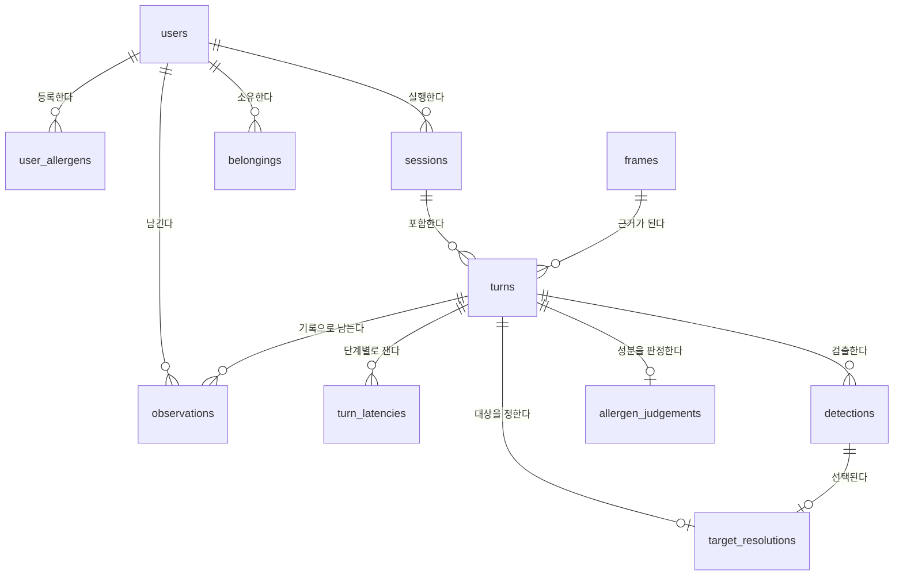

# 데이터베이스 설계 (ERD)

DBMS는 **PostgreSQL**. 스키마의 원본은 `src/jarviseo/memory/models.py` 이고,
이 문서는 그것을 사람이 읽는 형태로 옮긴 것이다.
**둘이 어긋나면 코드가 맞다.** 코드를 고친 사람이 이 문서를 같이 고친다.

테이블은 11개이고 네 덩어리로 나뉜다.

| 덩어리 | 테이블 | 담당 |
|---|---|---|
| 사용자 | `users` `user_allergens` | 문태현 |
| 대화 기록 | `sessions` `frames` `turns` `turn_latencies` | 문태현 |
| ① 지시 대상 특정 | `detections` `target_resolutions` | 최홍묵 |
| ② 식품 성분 판정 | `allergen_judgements` | 권용현 |
| ③④ 소지품·기억 | `belongings` `observations` | 문태현 |

---

## 관계도



`turns` 가 중심이다. 대화 한 번이 한 행이고, 나머지는 그 턴에 달라붙는다.

---

## 1. 사용자 · `users`

주인님. 지금은 1명이지만 테이블로 둔다. 데모에서 사용자를 바꿔 보여줄 수 있고,
알레르기 판정이 **누구 기준인지**가 기록에 남는다.

| 논리명 | 물리명 | 타입 | 설명 |
|---|---|---|---|
| 사용자 번호 | `id` | INTEGER PK | |
| 이름 | `name` | VARCHAR(50) UQ | |
| 메모 | `note` | TEXT | 자유 메모 |
| 등록 시각 | `created_at` | TIMESTAMPTZ | |

## 2. 사용자 알레르기 · `user_allergens`

"땅콩 알러지가 있는 주인님께는 추천드리지 않습니다"의 근거.

| 논리명 | 물리명 | 타입 | 설명 |
|---|---|---|---|
| 번호 | `id` | INTEGER PK | |
| 사용자 번호 | `user_id` | INTEGER FK → users | |
| 알레르겐 | `allergen` | VARCHAR(50) | "땅콩", "우유" |
| 심각도 | `severity` | VARCHAR(20) | `avoid` / `caution` — 경고 문구 강도를 고른다 |

## 3. 실행 세션 · `sessions`

앱을 켜고 끌 때까지의 한 구간. **monotonic 시각의 기준점**이다.
세션이 다르면 monotonic 값끼리 비교할 수 없다.
벤치마크를 "어느 실행에서 잰 숫자인가"로 묶는 단위이기도 하다.

| 논리명 | 물리명 | 타입 | 설명 |
|---|---|---|---|
| 세션 번호 | `id` | INTEGER PK | |
| 사용자 번호 | `user_id` | INTEGER FK → users | |
| 시작 시각 | `started_at` | TIMESTAMPTZ | |
| 종료 시각 | `ended_at` | TIMESTAMPTZ NULL | |
| 실행 장비 | `device` | VARCHAR(50) | "macbook-m3" — 벤치마크 비교용 |
| 프레임 입력원 | `frame_source` | VARCHAR(30) | `usbcam` / `folder` |

## 4. 프레임 · `frames`

질문 시점에 고른 사진 한 장. **이미지는 DB에 넣지 않고 경로만 둔다**
(1080p 한 장이 수백 KB라 쌓이면 금방 무거워진다).

| 논리명 | 물리명 | 타입 | 설명 |
|---|---|---|---|
| 프레임 번호 | `id` | INTEGER PK | |
| 이미지 경로 | `image_path` | VARCHAR(500) | |
| 입력원 식별자 | `source_id` | VARCHAR(100) | "usbcam:0" |
| 캡처 시각 | `captured_at_monotonic` | FLOAT | 발화 시각과 맞추는 데 쓴다 |
| 선명도 | `sharpness` | FLOAT NULL | Laplacian 분산 |
| 가로 · 세로 | `width` `height` | INTEGER | |
| 생성 시각 | `created_at` | TIMESTAMPTZ | |

> 선명도를 남기는 이유: "틀린 답이 흐린 프레임 때문이었나"를 되짚기 위해서다.

## 5. 대화 턴 · `turns`

**가장 중요한 테이블.** "자비서, 저거 뭐야?" 부터 음성 답변까지가 한 행이다.
대시보드의 채팅 이력·지연 그래프·정확도 측정이 전부 여기서 나온다.

| 논리명 | 물리명 | 타입 | 설명 |
|---|---|---|---|
| 턴 번호 | `id` | INTEGER PK | |
| 세션 번호 | `session_id` | INTEGER FK → sessions | |
| 프레임 번호 | `frame_id` | INTEGER FK → frames NULL | |
| 발화 원문 | `utterance` | TEXT | STT 결과 |
| 발화 시작 시각 | `utterance_started_monotonic` | FLOAT | 이 값으로 프레임을 고른다 |
| STT 확신도 | `stt_confidence` | FLOAT NULL | |
| 의도 | `intent` | VARCHAR(30) | `types.Intent` 값 |
| 응답 | `response` | TEXT | |
| 되묻기 여부 | `needs_clarify` | BOOLEAN | |
| 재촬영 횟수 | `recapture_count` | INTEGER | |
| 되묻기 횟수 | `clarify_count` | INTEGER | |
| 오류 | `error` | TEXT NULL | |
| 생성 시각 | `created_at` | TIMESTAMPTZ | |

> 재촬영·되묻기 횟수를 남기는 이유: 되묻기가 이 프로젝트의 차별점이라
> "얼마나 자주 되물었나"가 그대로 지표가 된다. 너무 잦으면 임계값이 높은 것이고,
> 0이면 임계값이 무의미했다는 뜻이다.

## 6. 단계별 지연 · `turn_latencies`

| 논리명 | 물리명 | 타입 | 설명 |
|---|---|---|---|
| 번호 | `id` | INTEGER PK | |
| 턴 번호 | `turn_id` | INTEGER FK → turns | |
| 단계 | `stage` | VARCHAR(30) | `stt` `detect` `vlm` `tts` … |
| 소요 시간 | `elapsed_ms` | FLOAT | |

> 턴마다 열을 늘리지 않고 행으로 쌓는 이유: 단계가 계속 늘어난다.
> **응답 지연 p50/p95의 원천 데이터가 이 테이블이다.**

## 7. 검출 결과 · `detections`

한 턴에서 검출한 물체 하나. 손끝도 여기 들어간다(`label="fingertip"`).

| 논리명 | 물리명 | 타입 | 설명 |
|---|---|---|---|
| 번호 | `id` | INTEGER PK | |
| 턴 번호 | `turn_id` | INTEGER FK → turns | |
| 라벨 | `label` | VARCHAR(50) | |
| 검출 확신도 | `confidence` | FLOAT | |
| 박스 좌표 | `x1` `y1` `x2` `y2` | FLOAT | 항상 넷이 같이 다녀서 따로 빼지 않는다 |
| 단서별 점수 | `cue_scores` | JSON | `{"hand":0.8,"gaze":0.3}` |
| 합산 점수 | `total_score` | FLOAT | |

## 8. 지시 대상 판정 · `target_resolutions`

'저거'가 무엇으로 결정됐는지. 턴당 한 행(`turn_id` UNIQUE).

| 논리명 | 물리명 | 타입 | 설명 |
|---|---|---|---|
| 번호 | `id` | INTEGER PK | |
| 턴 번호 | `turn_id` | INTEGER FK → turns UQ | |
| 선택된 검출 | `chosen_detection_id` | INTEGER FK → detections NULL | |
| 점수차 | `margin` | FLOAT | 1위 − 2위 |
| 되묻기 여부 | `needs_clarify` | BOOLEAN | |
| 되묻기 문장 | `clarify_question` | TEXT NULL | |
| 켜져 있던 단서 | `enabled_cues` | JSON | `["hand","salience"]` — ablation 표의 어느 줄인지 |
| 정답 여부 | `is_correct` | BOOLEAN NULL | 사람이 나중에 채점 |

> **대상 선택 정확도가 `is_correct` 에서 나온다.** 평가셋을 돌린 뒤
> 대시보드에서 맞다/틀리다를 눌러 채우는 것을 전제로 둔다.

## 9. 알레르기 판정 · `allergen_judgements`

| 논리명 | 물리명 | 타입 | 설명 |
|---|---|---|---|
| 번호 | `id` | INTEGER PK | |
| 턴 번호 | `turn_id` | INTEGER FK → turns UQ | |
| 판정 | `verdict` | VARCHAR(20) | `safe` / `warn` / `uncertain` |
| 매칭된 표기 | `matched_terms` | JSON | `["탈지분유"]` |
| 매칭된 알레르겐 | `matched_allergens` | JSON | `["우유"]` |
| 근거 | `reason` | TEXT | |
| OCR 원문 | `ocr_raw_text` | TEXT | |
| 파싱된 성분 | `ingredients` | JSON | |
| OCR 확신도 | `ocr_confidence` | FLOAT NULL | |
| 정답 여부 | `is_correct` | BOOLEAN NULL | recall 계산 근거 |

> 표기와 알레르겐을 따로 두는 이유: 성분표의 "탈지분유"와 알레르겐 "우유"는 다르다.
> 둘 다 있어야 "탈지분유가 들어 있어 우유 알레르기에 해당합니다"라고 설명할 수 있고,
> 동의어 사전이 틀렸을 때 어디가 틀렸는지 찾을 수 있다.

## 10. 등록 소지품 · `belongings`

| 논리명 | 물리명 | 타입 | 설명 |
|---|---|---|---|
| 번호 | `id` | INTEGER PK | |
| 사용자 번호 | `user_id` | INTEGER FK → users | |
| 물품명 | `name` | VARCHAR(100) | 같은 물건을 여러 각도로 등록하므로 UNIQUE 아님 |
| 메모 | `note` | TEXT | |
| 이미지 경로 | `image_path` | VARCHAR(500) | |
| Chroma 참조 | `chroma_id` | VARCHAR(100) UQ | |
| 등록 시각 | `created_at` | TIMESTAMPTZ | |

## 11. 관찰 기록 · `observations`

"아까 본 그거"를 위해 남기는 과거 장면.

| 논리명 | 물리명 | 타입 | 설명 |
|---|---|---|---|
| 번호 | `id` | INTEGER PK | |
| 사용자 번호 | `user_id` | INTEGER FK → users | |
| 턴 번호 | `turn_id` | INTEGER FK → turns NULL | |
| 설명 | `text` | TEXT | |
| 이미지 경로 | `image_path` | VARCHAR(500) NULL | |
| Chroma 참조 | `chroma_id` | VARCHAR(100) UQ | |
| 관찰 시각 | `observed_at` | TIMESTAMPTZ | |

---

## 설계 결정 4가지

1. **시각은 두 종류를 구분한다.** `created_at`(벽시계)와 `*_monotonic`.
   monotonic 은 프로그램을 껐다 켜면 기준이 바뀌므로 세션 밖에서는 의미가 없다.
2. **Enum 은 문자열로 저장한다.** Postgres ENUM 은 값 추가마다 마이그레이션이 필요한데
   `Intent`·`CueKind` 는 프로젝트 도중 늘어날 것이 확실하다.
3. **길이가 정해지지 않은 목록은 JSON.** 낱개로 조회할 일이 없어 테이블을 나눌 이유가 없다.
   JSONB 대신 JSON 을 쓰는 이유는 SQLite 로도 돌려야 하기 때문이다(테스트).
4. **이미지와 벡터는 DB에 넣지 않는다.** 경로와 `chroma_id` 만 둔다.
   벡터를 두 군데 두면 어긋났을 때 어느 쪽이 맞는지 알 수 없다.

---

## 스키마 만들기

```bash
docker compose up -d db
python -c "from jarviseo.memory import MemoryStore; MemoryStore().init_schema()"
```

검증: `pytest tests/test_db_schema.py`
