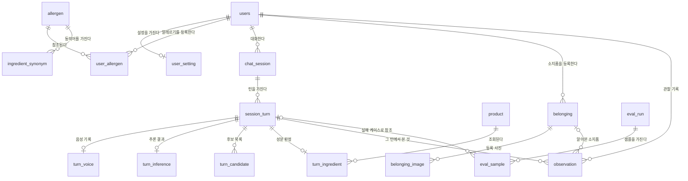

# 데이터베이스 설계 (ERD)

DBMS는 **PostgreSQL 16 + pgvector**. 원본은 팀 ERDCloud 다이어그램 **JARVISEO** 이고,
이 문서는 그것을 그대로 옮긴 것이다. 다이어그램이 바뀌면 이 문서도 같이 고친다.
그림은 `docs/erd-diagram/JARVISEO-ERD.png`.

`src/jarviseo/memory/models.py` 가 이 ERD 를 코드로 옮긴 것이다(2026-10-02 동기화).
일부러 다르게 둔 곳은 맨 아래 "코드 반영 상태" 에 적었다.

테이블 17개, 여섯 덩어리다.

| 덩어리 | 테이블 | 담당 |
|---|---|---|
| 사용자 | `users` `user_setting` `user_allergen` | 공통 |
| 대화 | `chat_session` `session_turn` `turn_voice` | 공통 · 음성은 문태현 |
| ① 가리킴 | `turn_inference` `turn_candidate` | 최홍묵 |
| ② 성분 | `turn_ingredient` `product` `allergen` `ingredient_synonym` | 권용현 |
| ③④ 소지품·기억 | `belonging` `belonging_image` `observation` | 문태현 |
| 평가 | `eval_run` `eval_sample` | 최홍묵 |

---

## 관계도

`session_turn` 이 중심이다. 질문 한 번이 한 행이고 나머지가 달라붙는다.

---

## 사용자

### 사용자 · `users`

| 논리명 | 물리명 | 타입 | 설명 |
|---|---|---|---|
| 사용자 ID | `user_id` | BIGSERIAL **PK** | |
| 이메일 | `email` | VARCHAR(255) | |
| 비밀번호 해시 | `password_hash` | VARCHAR(60) | bcrypt 해시. 평문 저장 금지 |
| 닉네임 | `nickname` | VARCHAR(50) NULL | |
| 가입일시 | `created_at` | TIMESTAMPTZ | |
| 수정일시 | `updated_at` | TIMESTAMPTZ | |

### 사용자 설정 · `user_setting`

사용자당 1행. 음성 취향과 세션 정책.

| 논리명 | 물리명 | 타입 | 설명 |
|---|---|---|---|
| 사용자 ID | `user_id` | BIGINT **PK/FK → users** | |
| 음성 크기 | `tts_volume` | SMALLINT | 기본 70 |
| 말하기 속도 | `tts_speed` | VARCHAR(10) | `SLOW` / `NORMAL` / `FAST` (기본 `NORMAL`). `voice/tts.py` 가 OpenAI speed 값(0.85 / 1.0 / 1.2)으로 변환 |
| 보이스 | `tts_voice` | VARCHAR(50) | 기본 `ko-KR-SunHiNeural` |
| 세션 초기화 시간(분) | `session_timeout_min` | SMALLINT | 무응답 N분 경과 시 종료 (기본 10) |
| 대상 검출 표시 | `show_detection_box` | BOOLEAN | 기본 true |
| 수정일시 | `updated_at` | TIMESTAMPTZ | |

### 사용자 알레르기 · `user_allergen`

| 논리명 | 물리명 | 타입 | 설명 |
|---|---|---|---|
| 사용자 알레르기 ID | `user_allergen_id` | BIGSERIAL **PK** | |
| 사용자 ID | `user_id` | BIGINT **FK → users** | |
| 알레르기 ID | `allergen_id` | SMALLINT **FK → allergen** | ERDCloud 에는 `allergen_id2` 로 적혀 있음(오타) |
| 엄격 모드 | `is_strict` | BOOLEAN | true면 미량·교차오염 의심도 경고. 같은 제조 시설 사용 등 |
| 등록일시 | `created_at` | TIMESTAMPTZ | |
| 수정일시 | `updated_at` | TIMESTAMPTZ | |
| 삭제일시 | `deleted_at` | TIMESTAMPTZ NULL | 소프트 삭제. NULL이면 사용 중 |

### 알레르기 마스터 · `allergen`

| 논리명 | 물리명 | 타입 | 설명 |
|---|---|---|---|
| 알레르기 ID | `allergen_id` | SMALLINT **PK** | |
| 알레르기명 | `name` | VARCHAR(50) **UK** | |
| 분류 | `category` | VARCHAR(20) | |

### 성분 동의어 사전 · `ingredient_synonym`

"탈지분유 → 우유" 같은 매핑. 성분 판정 recall 이 여기 품질에 달려 있다.

| 논리명 | 물리명 | 타입 | 설명 |
|---|---|---|---|
| 동의어 ID | `synonym_id` | BIGSERIAL **PK** | |
| 알레르기 ID | `allergen_id` | SMALLINT **FK → allergen** | |
| 동의어 | `alias` | VARCHAR(100) **UQ** | |

---

## 대화

### 대화 세션 · `chat_session`

| 논리명 | 물리명 | 타입 | 설명 |
|---|---|---|---|
| 세션 ID | `session_id` | BIGSERIAL **PK** | |
| 사용자 ID | `user_id` | BIGINT NULL **FK → users** | 비로그인 사용도 가능해 NULL 허용 |
| 세션 제목 | `title` | VARCHAR(200) NULL | |
| 시작일시 | `started_at` | TIMESTAMPTZ | |
| 수정일시 | `updated_at` | TIMESTAMPTZ | |
| 종료일시 | `ended_at` | TIMESTAMPTZ NULL | |
| 종료 사유 | `end_reason` | VARCHAR(20) NULL | `TIMEOUT` / `USER` / `APP_CLOSE` |

### 질문·응답 턴 · `session_turn`

**가장 중요한 테이블.** 질문 한 번이 한 행이다.

| 논리명 | 물리명 | 타입 | 설명 |
|---|---|---|---|
| 턴 ID | `turn_id` | BIGSERIAL **PK** | |
| 세션 ID | `session_id` | BIGINT **FK → chat_session** | |
| 질문일시 | `asked_at` | TIMESTAMPTZ | |
| 트리거 방식 | `trigger_type` | VARCHAR(20) | `WAKEWORD` / `BARGE_IN` / `CLARIFY_REPLY` |
| 질문 내용 | `question_text` | TEXT | |
| 응답 내용 | `answer_text` | TEXT NULL | |
| 이미지 경로 | `image_path` | VARCHAR(500) NULL | 질문 시점 1장. 개인정보 이슈로 영상·연속 사진은 저장 안 함 |
| OCR 원문 | `ocr_text` | TEXT NULL | |
| 전체 지연(ms) | `total_ms` | INTEGER NULL | |

### 턴 음성 · `turn_voice`

`session_turn` 과 1:1. STT·TTS 쪽 기록만 따로 모았다.

| 논리명 | 물리명 | 타입 | 설명 |
|---|---|---|---|
| 턴 ID | `turn_id` | BIGINT **PK/FK → session_turn** | |
| 발화 시작 시각 | `speech_started_at` | TIMESTAMPTZ NULL | 프레임 선택 기준 |
| 발화 종료 시각 | `speech_ended_at` | TIMESTAMPTZ NULL | |
| STT 원문 | `stt_raw_text` | TEXT NULL | |
| 재생 중단 여부 | `is_interrupted` | BOOLEAN | BARGE_IN 으로 재생이 중단됐으면 true |
| 선응답 여부 | `is_filler_sent` | BOOLEAN | 1.5초 내 응답이 없어 "잠깐만요" 선응답이 나갔으면 true |
| 음성 파일 경로 | `audio_path` | VARCHAR(500) NULL | 개발·평가 모드에서만 저장(STT 평가셋용). 운영 시 NULL |
| STT 지연(ms) | `stt_ms` | INTEGER NULL | |
| TTS 첫 청크 지연(ms) | `tts_ms` | INTEGER NULL | 응답 텍스트 확정 → 첫 오디오 청크 수신(TTFB). 전체 합성 시간 아님 |

---

## ① 가리킴 (담당 최홍묵)

### 턴 추론 결과 · `turn_inference`

`session_turn` 과 1:1 (PK를 FK로 공유하는 식별 관계).

| 논리명 | 물리명 | 타입 | 설명 |
|---|---|---|---|
| 턴 ID | `turn_id` | BIGINT **PK/FK → session_turn** | |
| 대상 라벨 | `target_label` | VARCHAR(50) NULL | |
| 확신도 | `confidence` | NUMERIC(4,3) NULL | |
| 마진 | `margin` | NUMERIC(4,3) NULL | 1위−2위. 임계값 미만이면 되묻기 |
| 가리킴 로직 버전 | `pointing_variant` | VARCHAR(20) NULL | v1~v5. 운영 데이터로 버전 비교 |
| 손끝 좌표 | `fingertip_xy` | JSONB NULL | 0~1 정규화. 벡터 재계산·디버깅 |
| 흐림 점수 | `blur_score` | NUMERIC(8,2) NULL | Laplacian variance. 재촬영 임계값 사후 조정 근거 |
| 최종 확정 주체 | `resolved_by` | VARCHAR(10) NULL | `MODEL`: 모델이 바로 확정 / `USER`: 되묻기에 대한 대답 턴(`CLARIFY_REPLY`)에서 사용자가 고름 = **정답 라벨** / `NULL`: 이 턴에서 되물어 아직 미확정 |
| 되묻기 여부 | `is_reask` | BOOLEAN | |
| 재촬영 여부 | `is_retake` | BOOLEAN | |
| 비전 처리 지연(ms) | `vision_ms` | INTEGER NULL | |
| LLM 지연(ms) | `llm_ms` | INTEGER NULL | |
| 라우팅 지연(ms) | `route_ms` | INTEGER NULL | |
| 선택 후보 ID | `chosen_candidate_id` | BIGINT NULL | `turn_candidate.candidate_id` 참조. 되묻기 전 1위와 최종 확정을 구분해 **되묻기의 정확도 기여**를 계산 |
| 프레임 시차(ms) | `frame_offset_ms` | INTEGER NULL | 발화 시작 시각 ↔ 선택된 프레임 캡처 시각 차이. 프레임 선택 로직 검증 근거 |
| 검출 개수 | `detected_count` | SMALLINT NULL | 후보가 1개뿐이면 `margin` 이 무의미하다. 난이도 구분용 |
| 검출 모델 버전 | `detector_version` | VARCHAR(30) NULL | YOLO 가중치 버전. 재학습하면 같은 `pointing_variant` 라도 결과가 달라진다 |

### 가리킴 후보 · `turn_candidate`

한 턴의 후보 물체들. 상위 N개를 남긴다.

| 논리명 | 물리명 | 타입 | 설명 |
|---|---|---|---|
| 후보 ID | `candidate_id` | BIGSERIAL **PK** | |
| 턴 ID | `turn_id` | BIGINT **FK → session_turn** | |
| 순위 | `rank` | SMALLINT | |
| 라벨 | `label` | VARCHAR(50) | |
| 점수 | `score` | NUMERIC(4,3) | |
| 박스 좌표 | `bbox` | JSONB | 0~1 정규화. 픽셀로 넣으면 해상도 바뀔 때 못 씀 |
| 선택 여부 | `is_chosen` | BOOLEAN | 최종 채택 1개만 true |
| 단서별 점수 | `cue_scores` | JSONB | 키 = ablation 단서. `center`(v1)·`point`(v2)·`gaze`(v3)·`lang`(v4)·`ctx`(v5). 예 `{"center":0.30,"point":0.82,"gaze":0.15,"lang":0.55,"ctx":0.00}` — 합산 `score` 만으로는 어느 단서가 이 후보를 밀어올렸는지 알 수 없다 |

---

## ② 성분 (담당 권용현)

### 턴 성분분석 결과 · `turn_ingredient`

| 논리명 | 물리명 | 타입 | 설명 |
|---|---|---|---|
| 턴 ID | `turn_id` | BIGINT **PK/FK → session_turn** | |
| 바코드 | `barcode` | VARCHAR(20) **FK → product** | |
| 조회 경로 | `source` | VARCHAR(10) NULL | 출처. 캐시 / API / OCR |
| 판정 | `verdict` | VARCHAR(10) NULL | 위험 / 주의 / 안전 |
| 걸린 성분 | `matched` | JSONB NULL | 걸린 이유 |
| 정규화 성분 | `normalized` | JSONB NULL | 성분 목록 |
| OCR 신뢰도 | `ocr_conf` | NUMERIC(4,3) NULL | |
| 재시도 횟수 | `retry_count` | SMALLINT NULL | 최대 시도 한계 설정용 |
| 응답 문장 | `response_text` | TEXT NULL | |
| OCR 지연(ms) | `ocr_ms` | INTEGER NULL | 최대 지연 한계 설정용 |
| 판정 지연(ms) | `match_ms` | INTEGER NULL | |
| 생성일시 | `created_at` | TIMESTAMPTZ NULL | |

### 바코드 제품 저장 · `product`

HACCP 공공데이터 / OCR 결과 캐시.

| 논리명 | 물리명 | 타입 | 설명 |
|---|---|---|---|
| 바코드 | `barcode` | VARCHAR(20) **PK** | |
| 제품명 | `product_name` | VARCHAR(200) | |
| 품목보고번호 | `report_no` | VARCHAR(30) | |
| 원재료 원문 | `raw_ingredients` | TEXT | 성분분석표에 있는 그대로 |
| 원재료 목록 | `ingredients` | JSONB | 성분을 나눈 목록 |
| 알레르기 표시 문구 | `allergen_notice` | VARCHAR(500) NULL | "OO 함유" 문구 |
| 교차오염 문구 | `cross_contamination` | VARCHAR(500) NULL | "같은 제조시설" 문구 |
| 확인 상태 | `status` | VARCHAR(10) NULL | `pending`: OCR로 처음 저장, 확인 전 / `verified`: HACCP에서 왔거나 OCR 결과가 다시 일치 / `invalid`: 잘못된 걸로 판명, 캐시로 쓰지 않음 |
| 확인 횟수 | `verify_count` | SMALLINT NULL | |
| 생성·수정일시 | `created_at` `updated_at` | TIMESTAMPTZ NULL | |

---

## ③④ 소지품·기억 (담당 문태현)

임베딩은 그 기록과 같은 행의 `VECTOR(n)` 열(pgvector)에 둔다.
벡터 DB 를 따로 두면 두 곳이 어긋났을 때 어느 쪽이 맞는지 알 수 없다.

### 내 소지품 · `belonging`

| 논리명 | 물리명 | 타입 | 설명 |
|---|---|---|---|
| 소지품 ID | `belonging_id` | BIGSERIAL **PK** | |
| 사용자 ID | `user_id` | BIGINT **FK → users** | |
| 이름 | `name` | VARCHAR(100) NULL | |
| 특징 설명 | `description` | TEXT NULL | |
| 등록·수정일시 | `created_at` `updated_at` | TIMESTAMPTZ NULL | |

### 소지품 등록 사진 · `belonging_image`

같은 물건을 여러 각도에서 여러 장 등록해야 재인식이 된다.

| 논리명 | 물리명 | 타입 | 설명 |
|---|---|---|---|
| 사진 ID | `belonging_image_id` | BIGSERIAL **PK** | |
| 소지품 ID | `belonging_id` | BIGINT **FK → belonging** | |
| 이미지 경로 | `image_path` | VARCHAR(500) NULL | |
| 이미지 임베딩 | `embedding` | VECTOR(512) NULL | CLIP |
| 임베딩 모델 | `embed_model` | VARCHAR(50) NULL | |
| 등록일시 | `created_at` | TIMESTAMPTZ NULL | |

### 관찰 기록 · `observation`

"아까 본 그거"를 찾을 때 검색하는 기록.

| 논리명 | 물리명 | 타입 | 설명 |
|---|---|---|---|
| 관찰 ID | `observation_id` | BIGSERIAL **PK** | |
| 사용자 ID | `user_id` | BIGINT **FK → users** | |
| 턴 ID | `turn_id` | BIGINT **FK → session_turn** | |
| 소지품 ID | `belonging_id` | BIGINT NULL **FK → belonging** | CLIP 임베딩으로 내 물건을 알아봤을 때만 연결. 못 알아보면 NULL |
| 장면 설명 | `description` | TEXT NULL | |
| 장소 | `place` | VARCHAR(100) NULL | |
| 텍스트 임베딩 | `embedding` | VECTOR(1536) NULL | text-embedding-3-small |
| 임베딩 모델 | `embed_model` | VARCHAR(50) NULL | |
| 관찰 시각 | `observed_at` | TIMESTAMPTZ NULL | |

---

## 평가 (담당 최홍묵)

### 실험 실행 · `eval_run`

| 논리명 | 물리명 | 타입 | 설명 |
|---|---|---|---|
| 실험 ID | `run_id` | BIGSERIAL **PK** | |
| 버전 | `variant` | VARCHAR(20) | v1~v5 |
| 실행일시 | `run_at` | TIMESTAMPTZ | |
| 샘플 수 | `sample_count` | INTEGER | |
| 지표 묶음 | `metrics` | JSONB | `{"accuracy":0.872,"reask_rate":0.14,"allergy_recall":0.96,"yolo_map50":0.731,"p50_ms":1840,"p95_ms":3120}` |
| 비고 | `note` | TEXT NULL | |

### 평가 샘플 · `eval_sample`

| 논리명 | 물리명 | 타입 | 설명 |
|---|---|---|---|
| 샘플 ID | `sample_id` | BIGSERIAL **PK** | |
| 실험 ID | `run_id` | BIGINT **FK → eval_run** | |
| 턴 ID | `turn_id` | BIGINT NULL **FK → session_turn** | 실사용 턴 재사용 시 연결. 실패 케이스에서 이미지·후보까지 추적 |
| 정답 라벨 | `gt_label` | VARCHAR(50) | |
| 예측 라벨 | `pred_label` | VARCHAR(50) NULL | |
| 정답 여부 | `is_correct` | BOOLEAN | |

---

## 코드 반영 상태

`models.py` 는 위 17개 테이블을 옮긴 상태다(2026-10-02). `pytest tests/test_db_schema.py` 가
테이블 목록이 정확히 이 17개인지 확인한다. `init_schema()` 는 Postgres 면 pgvector 확장부터 켠다.

**코드에서 일부러 다르게 둔 곳** — ERDCloud 내보내기 그대로 옮기면 깨지는 자리다.

| 위치 | ERDCloud | 코드 | 이유 |
| --- | --- | --- | --- |
| `turn_candidate` PK | (`candidate_id`, `turn_id`) | `candidate_id` | 식별 관계가 FK 를 PK 에 끼워 넣은 것. `candidate_id` 하나로 이미 유일하다 |
| `eval_sample` PK | (`sample_id`, `run_id`, `turn_id`) | `sample_id` | `turn_id` 가 NULL 허용이라 Postgres 에서 PK 에 들어갈 수 없다 |
| `user_allergen` | `allergen_id2` | `allergen_id` | 끝의 `2` 는 오타 |
| `allergen_id` 참조 열 | `SMALLSERIAL` | `SMALLINT` | 참조값이라 자동증가가 아니다 |
| `product` 기본값 | `report_no` = `false`, `raw_ingredients` · `ingredients` = `now()` | 빈 문자열 · 빈 목록 | 다른 열에서 복사돼 온 기본값 |

**ERD 에 아직 없는 것**

- 실행 장비 · 프레임 입력원 — 벤치마크를 "맥북에서 잰 것"과 "Colab 에서 잰 것"으로 나눌 근거.
  당분간 `eval_run.metrics` 에 같이 적어 둔다.

**ERD 쪽에서 고쳐야 할 것**

| 테이블 | 컬럼 | 문제 |
| --- | --- | --- |
| `user_allergen` | `allergen_id2` | 이름 끝의 `2`. 타입도 `SMALLSERIAL` → `SMALLINT` |
| `ingredient_synonym` | `allergen_id` | `SMALLSERIAL` → `SMALLINT`, NULL 허용 → NOT NULL |
| `allergen` · `ingredient_synonym` | PK | PK 가 NULL 허용으로 표시돼 있음 |
| `product` | `report_no` | 기본값 `false`, 코멘트가 `user_allergen.is_strict` 것 |
| `product` | `raw_ingredients` · `ingredients` | 기본값이 `now()` — 텍스트·JSONB 에 타임스탬프 |
| `turn_inference` | `resolved_by` | 코멘트를 위 표의 `MODEL` / `USER` / `NULL` 정의로 바꿀 것 |
| `turn_candidate` | `cue_scores` | 코멘트 맨 앞에 "키 = ablation 단서. center(v1)·point(v2)·gaze(v3)·lang(v4)·ctx(v5)" 추가 |

**관계선이 빠진 곳** — 컬럼은 있는데 내보낸 DDL 에 FK 가 없다. 코드에는 전부 FK 로 걸려 있다.

- `chat_session.user_id` → `users`
- `session_turn.session_id` → `chat_session`
- `user_allergen.user_id` → `users`, `user_allergen.allergen_id2` → `allergen`
- `ingredient_synonym.allergen_id` → `allergen`
- `turn_ingredient.barcode` → `product`
- `belonging.user_id` → `users`, `belonging_image.belonging_id` → `belonging`
- `observation.user_id` → `users`, `observation.turn_id` → `session_turn`, `observation.belonging_id` → `belonging`
